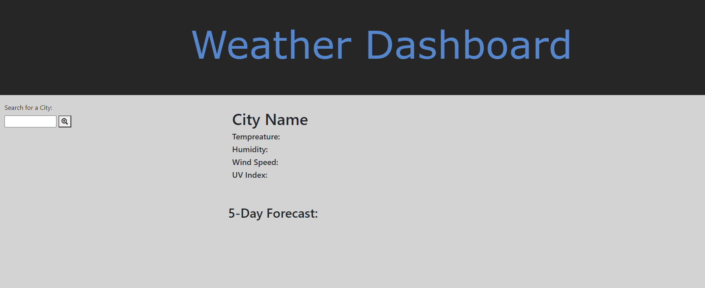
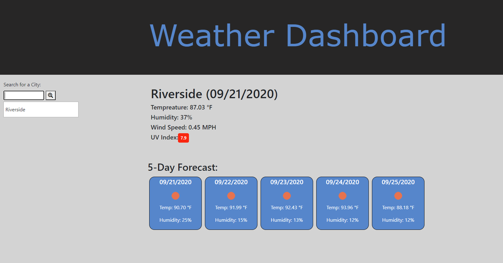
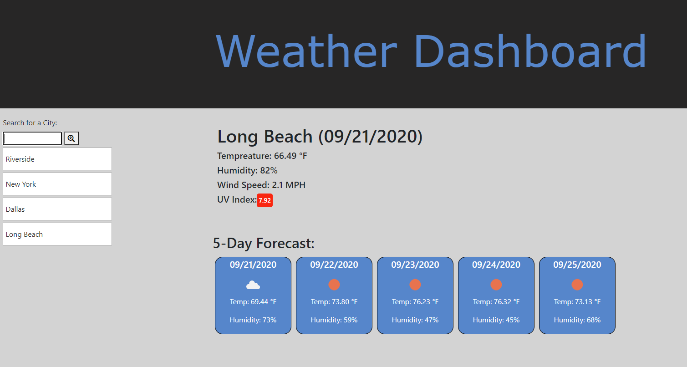

# Weather Dashboard (Homework - 6)

* root folder contains:

* README.md      (Read Me File)
* index.html     (Day Planner Page)
* \assets\       (CSS and Images Folder)
*   \js\        (Folder that hold the javascript.js file)
*   \css\       (Folder that holds CSS)
*   \images\     (Folder that holds the image files)

* Main View will appear when Dashboard loads.
* Enter a city name into the Search bar and press "Enter" or click the start button.
* The city entered will appear with Current Day temp values (in Farenheit) along with a 5 day forcast.
* The entered city will also be placed under the search bar as a history. 
* Any of the cities from the history list can be clicked on to pull back up the infromation related to that city.

* KNOWN ERRORS!!!!!
* If you type the city name wrong, the city will still appear on the histroy list, but will NOT provide information on the city, because the city does not acctually exist.

* Got to the 
<a href="https://bbrintle.github.io/6-Weather-Dashboard/">Weather Dashboard</a>

